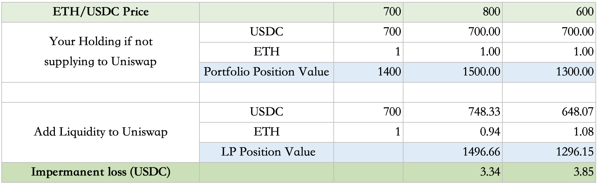

### 42. How is SynFutures’s market trading price, or fair price determined?  

For fair price SynFutures follows a Constant Product Formula model. Market prices are determined by the amount of sAMM’s asset position in a pool with function: $x*y=k$, where $x$ and $y$ are the amount of AMM’s Base and Quote asset positions of a trading pair, and $k$ is a constant number. To maintain $k$, the balances are adjusted during the execution of the trade, therefore changing the price. 

### 43. How is the spot index price determined? 

SynFutures@v1 currently only introduces Uniswap and Chainlink as Oracle and requires Quote to be a native asset on Ethereum: recall a trading pair consist of Base/Quote asset. For example, for ETH/USDC, ETH is the Base asset and USDC is the Quote asset. 

•	 If Base is also a native asset on Ethereum, SynFutures@v1 uses Uniswap as the price Oracle by default. 

•	 If Base is not a native asset on Ethereum, SynFutures@v1 uses Chainlink as the price Oracle by default. 

For Uniswap as Oracle, SynFutures@v1 directly reads the quantity numbers of two assets in the underlying trading pair in Uniswap, and divides them to get the index price. In order to minimize the price fluctuation caused by price manipulation, a global parameter was introduced and if the index price input exceeds the allowable range of this parameter, the max allowable value is used as the index price.   

For Chainlink as Oralce, SynFutures@v1 has no special handling but treats Chainlink's USD price quotation as the quotation for USDC. For example, If the BTC/USD pricing fed by Chainlink is 30,000, the BTC/USDC futures contract of SynFutures@v1 treats the current pricing of BTC as 30,000 USDC. 

### 44. How is the mark price determined? 

At TRADING Stage of a trade, mark price is defined as below

$\text{\small{Basis}}_T = \text{\small{FairPrice}}_T-\text{\small{IndexPrice}}_T$

$\text{\small{MarkBasis}}_T = \alpha \cdot \text{\small{Basis}}_T + (1-\alpha) \cdot \text{\small{MarkBasis}}_{T-1},\ \alpha = 1-e^{-\Delta T/\tau}$

$\text{\small{MarkPrice}}_T = \text{\small{IndexPrice}}_T + \text{\small{MarkBasis}}_T$

At SETTLING stage, basis is assumed to be 0 and the mark price will be the time-weighted average price (TWAP) of spot index price to facilitate the price convergence to the spot and the eventual settlement.  

### 45. How do you protect users from large price movement? or what are the restrictions imposed by SynFutures? 

To protect user interest and avoid unintended price volatility, SynFutures imposes below restrictions, which would not affect normal users but mainly be triggered when there’s large movement in a single block or from a single user. 

**Max Price Slippage Ratio**:  maximum price deviation in a single block for either direction from the mid-price at the start of the current block. This serves as a limit of price slippage for the AMM and protects the system from attacks distorting the market within the same block. A trade would be reverted if it results in a price breaching this limit of this block.  

**Max Initial Daily Basis**:  maximum deviation of initial futures price to spot index per day to limit the initial price for AMM in a reasonable range.

**Max User Trade Open Interest Ratio**: maximum open interest ratio of the entire market for a single user(address) to prevent concentration of risk in a single account. When a user's account has a higher open interest ratio than this limit, the user can only execute trades to reduce position but not increase position. This limit does not apply to the action of LP adding liquidity to the AMM. But if an LP's position breaches the limit after adding liquidity to the AMM, they cannot increase their position further through trade. 

**Min Amm Open Interest Ratio**: minimum open interest ratio of the entire market for the AMM to prevent a drain of liquidity. The AMM needs to maintain a certain level of inventory to prevent large slippages as every user can only trade with the AMM. This limit applies to both users buying from the AMM and LPs removing liquidity.

**Max Spot Index Change Per Second Ratio**:maximum spot index change that can be accepted since the last update, measuring in seconds. As mark price is updated at most once per block, this serves as a limit of the mark price change per block and protects the system from attacks distorting the underlying Oracle in a short period of time.

### 46. What is the potential impermanent loss I might have as an LP? Could you walk me through an example?

Assuming you have 1 synthetic ETH position and 700 USDC position as a liquidity provider and ETH/USDC = 700 when you supply liquidity, and separately, you have sufficient margin to safely cover your ETH SHORT hedging position. 

The impermanent loss would be calculated as below 

Note that for simplicity, we use the term ETH/USDC price to represent futures fair price and spot price: the two might be different but if as LP you wait until settlement to withdraw LP token, settlement price and spot price would convert.  

 Everything else equals, the potential impermanent loss is the same as supplying to other CFMM such as Uniswap. 

