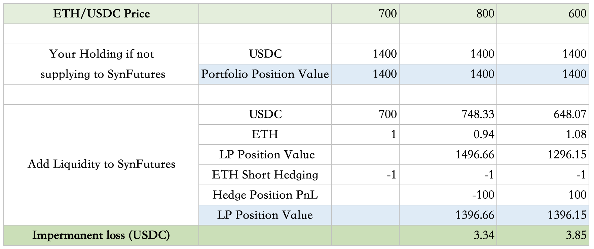

### 1. What is SynFutures ?

SynFutures is a decentralized synthetic asset derivatives trading platform. In the first version, it launches a Ethereum-based Futures market for a variety of assets, including Ethereum native, cross-chain and off-chain real world assets to be synthesized and freely traded against ERC20 tokens used as margin.
### 2. Who are the ecosystem players in SynFutures

**Trader**: trades Futures products on the platform

**Liquidity Provider (AMM)**: creates trading pairs, supplies liquidity to the system, always ready to make prices based on model and earn majority of the trading fees

**Liquidator**: liquidates traders’ positions when margin is insufficient. SynFutures provides two ways for liquidators (1) initiate a trade with liquidator’s own account funds and take over the trader’s position as well as remaining margin (2) initiate a transaction for trader to close its position with Auto Liquidator ( in V1, the AMM itself) and earn system rewards

**System Maintainer**: helps maintain the operations of the system including system’s trade state update and some other required services such as bug fix, code contribution etc as the system develops in a later stage, and earn rewards.

**Insurance Fund**: part of trader’s remaining margin when liquidation happens would go to insurance fund and be paid out to liquidator and AMM when liquidation results in balance insolvency.

**System Reserve Fund**: part of the trader’s trading fees would go to System Reserve Fund to pay out rewards to liquidators who initiate liquidation with AMM and system maintainers.

**Oracle**: supplies pricing data to the system.

### 3. What are the instruments traded on SynFutures?

In its first version, SynFutures supports trading of linear non-deliverable Futures contracts, each of which is uniquely defined by (1) trading pairs and (2) maturity. Trading pair can be further split into Base and Quote assets. As an example, for ETH/USDC, ETH is the Base Asset and USDC is the Quote Asset.

The Quote asset should be an ERC 20 token used as the margin for the Futures Contract and the BASE asset has no restriction as long as such oracle is available.

### 4. What Quote Assets are SynFutures currently supported?

Though in design and theory, SynFutures could support any ERC 20 token as Quote asset, for liquidity to be more concentrated, the assets that can be used as Quote when SynFutures@v1 launches include: ETH, USDC, USDT, and DAI.

### 5. What is the life cycle of a trade

A futures trade typically goes through **three stages**:

1. **Normal**: A futures contract enters the Normal state when newly created and initialized until the Settling state. During this state system players could perform all available functions.

2. **Settling**: last hour before contract expiry. This state is to prepare for the smooth settlement of contracts. Users are only allowed to reduce but not open or increase position. This implies that a trader can only close outstanding positions and LP can remove but not add liquidity.

3. **Settled**: The state the trade enters after futures expiry, where only settlement of the trade is allowed. Trader can only close its own position and settle funds according to the settlement price; and LP can only withdraw assets provided to the liquidity pool with the LP Token.

And an additional “Emergency” state would be entered into if unforeseen abnormal conditions on chain (such as Oracle failures, etc) happens. Normal users and LPs are not allowed to perform any operations, and the system administrator will guide the futures contract into the Settled State with a fair and reasonable settlement price.

### 6. How are pricings determined?

There are three types of price in SynFutures contracts.

1. **Fair Price**: SynFutures market trading price as implied by AMM inventories. The futures price trader/market maker execute for a transaction which follows a Constant Product Formula model x*y=k.

2. **Index Price**: Spot price of the trading pairs as supplied by Oracles. Currently we use Uniswap and Chainlink for index price

3. **Mark Price**: Price to determine whether a futures position should be liquidated and the settlement price at expiry. At normal state, it is defined as spot Index Price + Mark Basis, where the Mark Basis keeps the relationship between futures price and spot index stable by applying exponential moving average (EMA) on past basis. While In the last hour of a Futures Contract, basis is assumed to be 0 and the Mark Price will be the Time-Weighted Average Price (TWAP) of Spot Index to facilitate the price convergence to the spot and the eventual settlement.

For detailed calculation of the pricings, please check Advance Topics: [How is Fair Price/Index Price/Mark Price determined?](#advance-topics)

### 7. What is my futures contract’s expiration time? 

For SynFutures V1, when launched, the expiration time of all futures contracts will be aligned to 8 am UTC time on every Friday of the week where the expiration time specified by the user is located. The restriction on the mandatory expiration time alignment will be relaxed at an appropriate time and the expiration time of all futures contracts will be aligned to the user-specified expiration date at 8 am UTC time, subject to the development of the market and could be varied by different trading pairs with different trading volumes and requirements. 
### 8. Why did my transaction fail?

A transaction might be failed due to insufficient gas fee, exceeding pricing slippage you specified or breaching the limitation SynFutures imposed to protect users etc , check Advance Topics: [How do you protect users from large price movement?](#29-how-do-you-protect-users-from-large-price-movement-what-are-the-restrictions-imposed-by-synfutures) for more details.  For a failed transaction, you could click on “View on Etherscan “ for more details. 

### 9. Why was my futures contract not expiring exactly at the preset expiration time on settlement day?  

Forcing a futures contract to enter Settling or Settled state may lead to the actual expiration time of the futures contract later than that specified time when the contract was created. This is because the status update of the smart contract itself can only be triggered by a transaction. To cope with this problem, SynFutures@v1 introduces an additional reward mechanism in order to encourage users to update the state of Futures contracts by initiating transactions. Check here [What other system reward I might potentially earn？](#25-what-other-system-reward-i-might-potentially-earn？) for details 

 

### 10. Has the contract been audited? 

 

Yes, SynFutures V1 was audited by PeckShield. [Check here for the full report](https://synfutures.com/PeckShield-Audit-SynFuturesV1-v1.0.pdf) 

 

 

### For Traders  

 

### 11. How to open/close a trade ? 

 

When open a new position, a trader should transfer the margin token (Quote Asset to its account to ensure its margin is sufficient, that is (AccountBalance + UnrealizedPnl) >= Position * MarkPrice * Initial Margin  

 

With the available margin, a trader could go to “Trade” page to input the trading pairs, click on “Buy/Long” or “Sell/Short” button to create a trade.  

 

To close a trade, just follow the reverse procedure – go to “Trade” page , select the contract you have traded, execute opposite positions of existing trades, and margin plus your pnl would be released to your account. Alternatively, you could go to Pool Page to view the list of trades you have and close the positions  

 

Note that trader can only trade with a pair that have existing market makers, that is, the pair should have been created and provided liquidity by LP. 

 

### 12. How to add/withdraw margin ? 

 

You could go to “Trade” page and select the contract you have traded,  or “Pool” page to view the list of existing trades and perform “Deposit” or “Withdraw” function under “Margin Operations”. 

 

Note that when you “withdraw” margin, your PnL would be calculated based on current Mark Price and the excess would become available for withdrawal. And your original trade’s Entry price would be reset to the current Mark Price. 

 

### 13. How to determine whether a trade’s position should be liquidated  

 

When Account Balance + Unrealized Pnl < Position * MarkPrice * Maintenance Margin (MMR), the account is no longer safe and can be liquidated 

 

### 14. What happen if my position doesn’t have sufficient margin? 

 

When your account becomes insolvent, liquidators would come and initiate liquidation process. 

 

If the liquidator uses traditional Defi approach, your full position would be taken over so you will lose all of your position and margin token. 

 

If the liquidator uses Auto Liquidator approach, your position will be partially liquidated to a safe state that meets the initial margin requirement. 

 

For details of the different liquidation approaches, check here [How could I become a liquidator](#21-how-do-i-become-a-liquidator) for details 

 

### 15. What is the fee charged when trading？ 

 

SynFutures charges a fixed %  of fees for all trades based on the transaction amount, to be split into two parts, one is system reserve fees (for trade state update and liquidation initiator, etc) and the rest would be paid out to transaction pool for LPs.  

 

 

  

### For Automated Market Maker/Liquidity Providers  

 

### 16. How does Syn Futures’ sAMM model work if I would like to add/remove liquidity? 

 

To add liquidity, LP transfers the Quote asset token only to the sAmm, among which half is used as Quote asset, and the other half to synthesize the position of the Base asset, that is, to create a 1x long position of the Base Asset for this futures contract. LP would then receive the respective LP tokens. 

 

Since LP originally held Quote assets only and did not have any exposure to the price risk of Base assets, the sAMM contract will at the same time allocate a short position of the same size as the newly created long position to the same user to hedge this risk. 

  

Removing liquidity from the sAMM follows a similar process where the sAMM would reduce its long position and allocate the reduced long position to the user requesting to remove liquidity and return the margin token to the user. Similarly, the action of removing liquidity from the sAMM does not change the total risk of the liquidity provider. 

 

### 17. How could I add liquidity to a trading pair? 

 

To provide liquidity, a LP interacts with the smart contracts via “Add Liquidity” button on “Pool” page from its account balance or “Add liquidity from Margin” button on “Account” Page from its available margin. Note that if the LP is adding liquidity from its existing trade’s available margin,  its PnL would be calculated based on current Mark Price and the excess would become available for withdrawal. And the original trade’s Entry price would be reset to the current Mark Price. 

 

 LP could only add liquidity to an existing pool, otherwise, it could firstly go to “Pool” page and click on “Create Pool” to create and initialize a new trading pair. 

 

### 18. What is “Adjust your leverage ratio” means and what position size would I get when adding X amount of liquidity? 

 

As mentioned earlier, when adding liquidity, half of the tokens is used as Quote, and the other half to synthesize AMM's long Base positions. In order to hedge AMM's Long positions, LP will passively be assigned the same amount of short positions after providing liquidity.  

 

Thus, when adding liquidity, an LP automatically also becomes a trader with a short position. To ensure the safety of the LP account’s short position, the LP should at the same time have margin available in its account to at least meet the initial margin requirement of the synthetic position. The leverage ratio parameter is used to specify the leverage of the short hedge position.  

 

To simplify the process, SynFutures App combines the process into one click, so when you add X Amount of Quote asset, the amount would be divided into three parts:  

 

(1) Y position size would be supplied as the Quote assets  

(2) Y position size would be synthesized into the Base assets  

(3) The rest would become the margin of your short position, which could be calculated as Initial Price * Position size/ Leverage Ratio 

 

The relationship between each parameter and size is: 

 

Amount (X) = initial Price * Position size (Y) * 2 + initial Price * Position size (Y) / Leverage ratio, or  

Position size (Y) =  Amount (X) / (2 * initial Price + initial Price / Leverage ratio) 

 

### 19. What is the reward I can get by supplying liquidity?  

 

You could receive trading fees according to your share of the liquidity pool. Additionally, SynFutures plans to launch onchain governance in the future, when early large LPs could also be rewarded with governance token. Exact details to be finalized. 

 

### 20. What is the market risk associated with providing liquidity and being an AMM?  

1) At the start, the action of adding liquidity to the sAMM does not change the total risk profile of the liquidity provider, as the newly created long and short positions exactly offset each other.  

 

2) After adding liquidity to sAMM, the liquidity provider has also become a trader due to the short hedging position, and needs to maintain sufficient margin in the account to meet the margin requirement or might face the risk of its short hedging position being liquidated. 

 

3) With sufficient margin for the short hedge position, the risk of being an AMM is similar to other protocol such as Uniswap adopting Constant Product Formula pricing model with possible impermeant loss (IM), with the amount of loss the same as supplying to Uniswap should everything else equal. Check Advance Topics: [What is the potential impermanent loss I might have as an LP?](#30-what-is-the-potential-impermanent-loss-i-might-have-as-an-lp-could-you-walk-me-through-an-example) 

 

### For liquidator and system maintainer 

 

### 21. How do I become a liquidator ? 

 

In SynFutures@v1, if an account is no longer safe according to the current mark price (Account Balance + Unrealized Pnl <Position * Mark Price * Maintenance Margin), any user of the current futures contract can initiate a liquidation operation for the account. SynFutures@v1 supports two types of liquidate operations: 

 

Traditional Defi Approach: The liquidator takes over all positions of the liquidated account at the current mark price. Note that in this case the liquidator should ensure it has sufficient balance in the account to meet the position’s maintenance margin requirement. After all positions of the liquidated account are closed, a penalty (deducted from the current account balance) is paid to the Insurance fund according to the total value of the liquidation 

 

Automated Liquidator Approach: To lower the liquidity requirement, liquidation initiators could utilize “LiquidatebyAMM” function to use the liquidity in Amm's account, and force the accounts that need to be liquidated to trade with AMM with the same price logic as the trade function. Note that if the position that needs to be liquidated causes excessive price fluctuations in AMM after being traded to AMM, the liquidation process will fail. 

 

It is worth mentioning that since AMM has always maintained liquidity in the system, partial liquidation becomes feasible under this operation: the account will be liquidated to a safe state that meets the initial margin requirement. 

 

### 22. What happen if the system becomes insolvent, i.e., balance of the account becomes negative resulting from liquidation? 

  

When the balance of the account becomes negative resulting from liquidation, the insurance fund of the futures contract will be firstly used to reward the liquidator, and cover the shortfall 

 

If the amount of the deficit exceeds the insurance fund balance, the excess loss will accumulate in the socialized loss in the opposite direction, and the loss will be shared in proportion to the positions held by all holders of the Long side at this time. 

 

### 23. What could liquidator benefit from initiating liquidation trades? 

 

With traditional Defi approach, liquidators supply liquidity, take over traders’ whole positions, and could be rewarded with the rest of the traders’ margin token after deduction of penalty. In the case where the traders’ margin is insufficient, the system’s insurance fund and social loss mechanism would firstly ensure payout of a minimum reward (as defined by bankruptcyLiquidatorRewardRatio) to the liquidator.  

 

With Auto Liquidator approach, the system reserve fund would pay out a system reward to liquidation initiator who forced the traders to close its position with AMM. 

 

 

### 24. How to determine who could be the liquidator if there are multiple liquidators targeting the same trade? 

  

It is on a “first come first served” basis. In practice, whoever initiates trade with sufficient gas fee and be the first to successfully completed the liquidation transaction would be the final liquidator of an insolvent position.  

 

### 25. What other system reward I might potentially earn？ 

 

You might also earn system reward by updating an inactive futures contract’s trade state: for inactive futures contract where there’s no trading activity at the pre-set time when it should have entered Settling or Settled state, you could call the “update” function, send a transaction to help update the trade state and earn the reward. This system reward is also paid out on a first-come-first-served basis. 

 

 

### Advance Topics:  

 

### 26. How is SynFutures’s market trading price, or Fair Price determined? 

 

For Fair price SynFutures follows a Constant Product Formula model. Market prices are determined by the amount of sAMM’s asset positions in a pool with function: x*y=k, where x and y are the amount of AMM’s Base and Quote asset positions of a trading pair, and k is a constant number. To maintain k, the balances are adjusted during the execution of the trade, therefore changing the price. 

 

### 27. How is the spot Index Price determined? 

 

SynFutures@v1 currently only introduces Uniswap and Chainlink as Oracle and requires Quote to be a native asset on Ethereum: recall a trading pair consist of Base/Quote asset. For example, for ETH/USDC, ETH is the Base Asset and USDC is the Quote Asset. 

 

•	 If Base is also a native asset on Ethereum, SynFutures@v1 uses Uniswap as the price Oracle by default. 

•	 If Base is not a native asset on Ethereum, SynFutures@v1 uses Chainlink as the price Oracle by default. 

 

For Uniswap as Oracle, SynFutures@v1 directly reads the quantity numbers of two assets in the underlying trading pair in Uniswap, and divides them to get the index price. In order to minimize the price fluctuation caused by price manipulation, a global parameter was introduced and if the index price input exceeds the allowable range of this parameter, the max allowable value is used as the index price.  

 

For Chainlink as Oralce, SynFutures@v1 has no special handling but treats Chainlink's USD price quotation as the quotation for USDC. For example, If the BTC/USD pricing fed by Chainlink is 30,000, the BTC/USDC futures contract of SynFutures@v1 treats the current pricing of BTC as 30,000 USDC. 

 

### 28. How is the Mark Price determined? 

 

At “Normal” Stage of a trade, Mark Price is defined as below

$Basis_T = FairPrice_T-IndexPrice_T$

$MarkBasis_T = \alpha \cdot Basis_T + (1-\alpha) \cdot MarkBasis_{T-1}, where \alpha = 1-e^{-\Delta T/\tau}$

$MarkPrice_T = IndexPrice_T + MarkBasis_T$

At “Settling” stage, basis is assumed to be 0 and the Mark Price will be the time-weighted average price (TWAP) of spot Index Price to facilitate the price convergence to the spot and the eventual settlement. 

 

 

### 29. How do you protect users from large price movement? What are the restrictions imposed by SynFutures? 

 

To protect user interest and avoid unintended price volatility, SynFutures imposes below restrictions, which would not affect normal users but mainly be triggered when there’s large movement in a Single block or from a Single user. 

 

**Max Price Slippage Ratio**:  maximum price deviation in a single block for either direction from the mid-price at the start of the current block. This serves as a limit of price slippage for the AMM and protects the system from attacks distorting the market within the same block. A trade would be reverted if it results in a price breaching this limit of this block  

 

**Max Initial Daily Basis**:  maximum deviation of initial futures price to spot index per day to limit the initial price for AMM in a reasonable range. 

 

**Max User Trade Open Interest Ratio**: maximum open interest ratio of the entire market for a single user(address) to prevent concentration of risk in a single account. When a user's account has a higher open interest ratio than this limit, the user can only execute trades to reduce position but not increase position. This limit does not apply to the action of LP adding liquidity to the AMM. But if an LP's position breaches the limit after adding liquidity to the AMM, they cannot increase their position further through trade 

 

**Min Amm Open Interest Ratio**: minimum open interest ratio of the entire market for the AMM to prevent a drain of liquidity. The AMM needs to maintain a certain level of inventory to prevent large slippages as every user can only trade with the AMM. This limit applies to both users buying from the AMM and LPs removing liquidity 

 

**Max Spot Index Change Per Second Ratio**:maximum spot index change that can be accepted since the last update, measuring in seconds. As mark price is updated at most once per block, this serves as a limit of the mark price change per block and protects the system from attacks distorting the underlying oracle in a short period of time  

 

 

### 30. What is the potential impermanent loss I might have as an LP? Could you walk me through an example? 

 

Assuming you have 1 Synthetic ETH position and 700 USDC position as a liquidity provider and ETH/USDC = 700 when you supply liquidity, and separately, you have sufficient margin to safely cover your ETH short hedging position. 

 

The impermanent loss would be calculated as below 

Note that for simplicity, we use the term ETH/USDC price to represent futures fair price and spot price: the two might be different but if as LP you wait until settlement to withdraw LP token, settlement price and spot price would convert.  

 

Everything else equals, the potential impermanent loss is the same as supplying to other CFMM such as Uniswap. 

