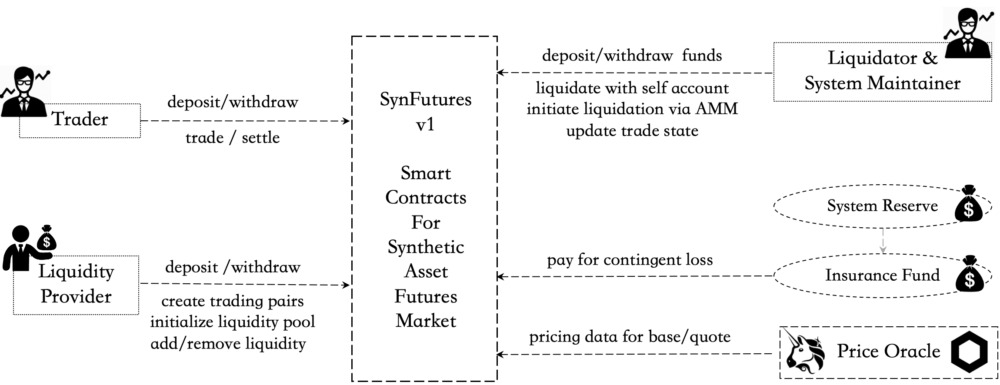

### 1. What is SynFutures?

SynFutures is a decentralized synthetic asset derivatives trading platform. In the first version, it launches a Ethereum-based futures market for a variety of assets, including Ethereum native, cross-chain, and off-chain real world assets to be synthesized and freely traded against ERC 20 tokens as margin.

### 2. Who are the ecosystem players in SynFutures?

**Trader**: trades futures products on the platform.

**Liquidity Provider (LP)**: creates trading pairs, supplies liquidity to the system, always ready to make prices based on model and earn majority of the trading fees.

**Liquidator**: liquidates traders’ positions when margin is insufficient. SynFutures provides two ways for liquidators:

- Initiate a trade with liquidator’s own account funds and take over the trader’s position as well as remaining margin.
- Initiate a transaction for trader to close its position with Auto Liquidator (in v1, the AMM itself) and earn system rewards.

**System Maintainer**: helps maintain the operations of the system including system’s trade state update and some other required services such as bug fix, code contribution etc. as the system develops in a later stage, and earn rewards.

**Insurance Fund**: part of trader’s remaining margin when liquidation happens would go to insurance fund and be paid out to liquidator and AMM when liquidation results in balance insolvency.

**System Reserve Fund**: part of the trader’s trading fees would go to system reserve fund to pay out rewards to liquidators who initiate liquidation with AMM and system maintainers.

**Oracle**: supplies pricing data to the system.

### 3. What are the instruments traded on SynFutures?

In its first version, SynFutures supports trading of linear non-deliverable futures contracts, each of which is uniquely defined by trading pairs and maturity. Trading pair can be further split into Base and Quote assets. As an example, for ETH/USDC, ETH is the Base asset and USDC is the Quote asset.

The Quote asset should be an ERC 20 token used as the margin for the futures contract and the BASE asset has no restriction as long as such Oracle is available.

### 4. What Quote assets does SynFutures currently support?

Though in design and theory, SynFutures could support any ERC 20 token as Quote asset, for liquidity to be more concentrated, the assets that can be used as Quote when SynFutures@v1 launches include: ETH, USDC, USDT, and DAI.

### 5. What is the life cycle of a trade?

A futures trade typically goes through **three stages**:

1. TRADING: A futures contract enters the TRADING state when newly created and initialized until the SETTLING state. During this state system players could perform all available functions.

2. SETTLING: last hour before contract expiry. This state is to prepare for the smooth settlement of contracts. Users are only allowed to reduce but not open or increase position. This implies that a trader can only close outstanding position and LP can remove but not add liquidity.

3. SETTLED: The state the trade enters after futures expiry, where only settlement of the trade is allowed. Trader can only close its own position and settle funds according to the settlement price; and LP can only withdraw assets provided to the liquidity pool with the LP Token.

And an additional “EMERGENCY” state would be entered into if unforeseen abnormal conditions on chain (such as Oracle failures, etc.) happens. Normal users and LPs are not allowed to perform any operations, and the system administrator will guide the futures contract into the SETTLED state with a fair and reasonable settlement price.

### 6. How are prices determined?

There are three types of price in SynFutures contracts.

1. **Fair price**: SynFutures market trading price as implied by AMM inventories. The futures trader execute for a transaction which follows a Constant Product Formula model $x*y=k$.
2. **Index price**: Spot price of the trading pairs as supplied by Oracles. Currently we use Uniswap and Chainlink for index price.
3. **Mark price**: Price to determine whether a futures position should be liquidated and the settlement price at expiry. At TRADING state, it is defined as spot IndexPrice + MarkBasis, where the MarkBasis keeps the relationship between futures price and spot index stable by applying Exponential Moving Average (EMA) on past basis. While In the last hour of a futures contract, basis is assumed to be 0 and the MarkPrice will be the Time-Weighted Average Price (TWAP) of Spot Index to facilitate the price convergence to the spot and the eventual settlement.

For detailed calculation of the pricings, please check [advanced topics](/docs/docs/advanced).

### 7. Has the smart contracts been audited?

Yes, SynFutures@v1 was audited by PeckShield. [Check here for the full report](https://synfutures.com/PeckShield-Audit-SynFuturesV1-v1.0.pdf).
