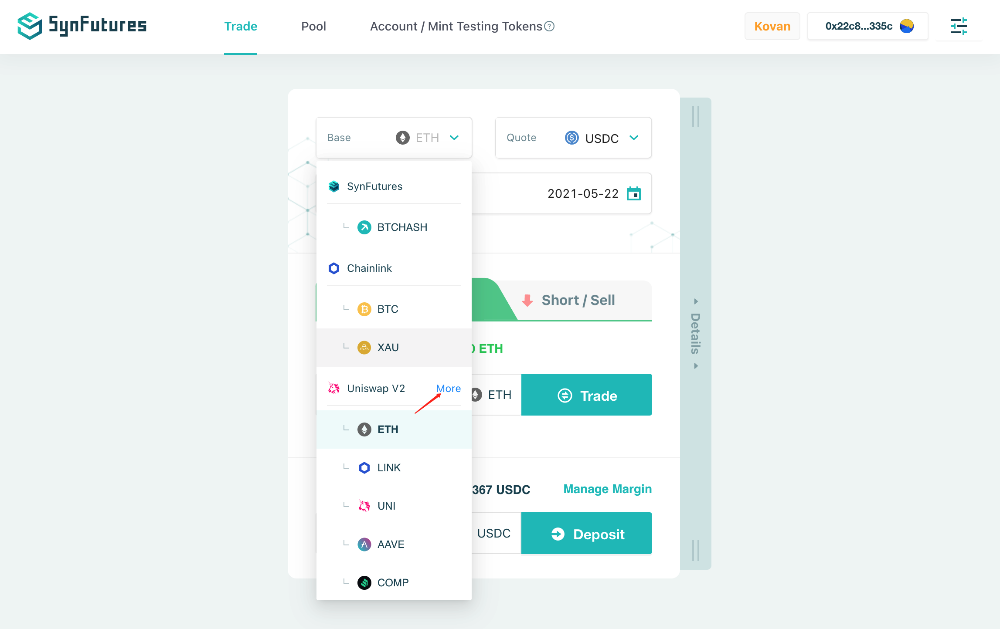
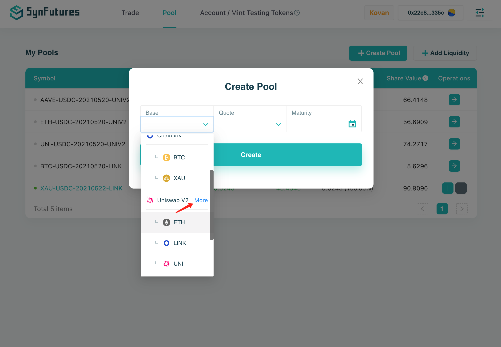
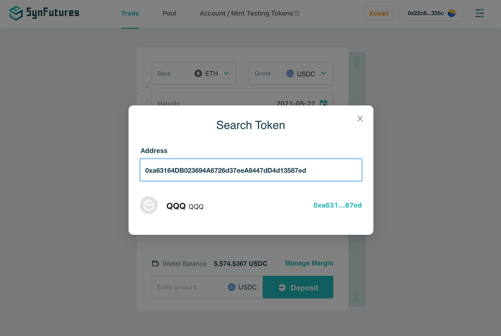
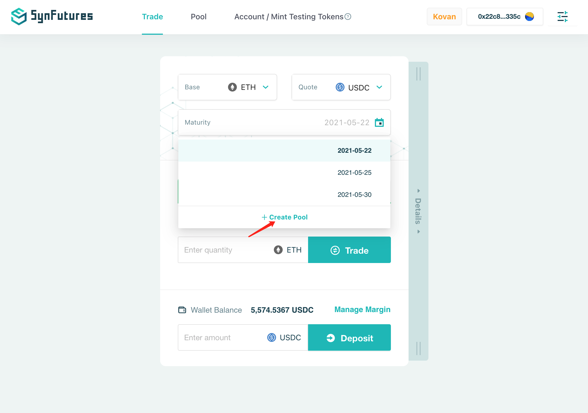
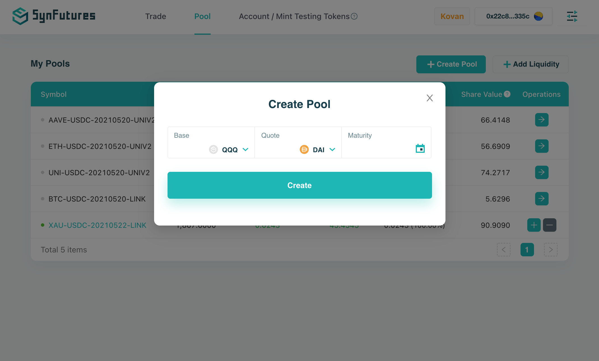
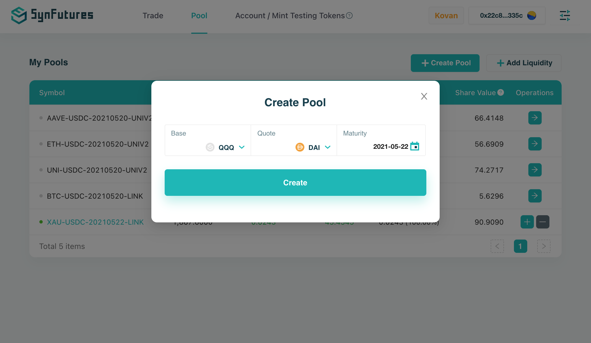
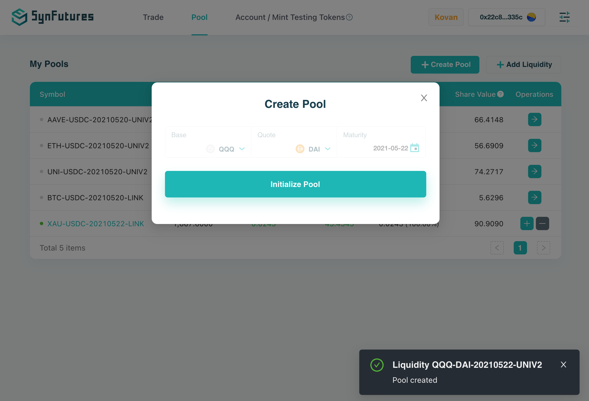
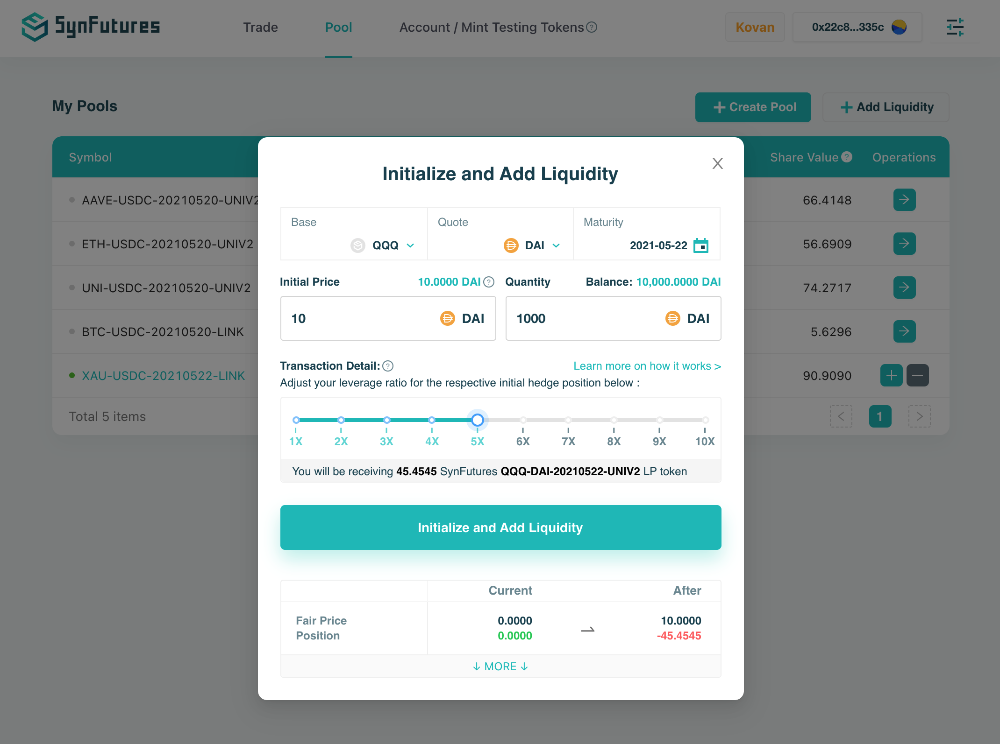
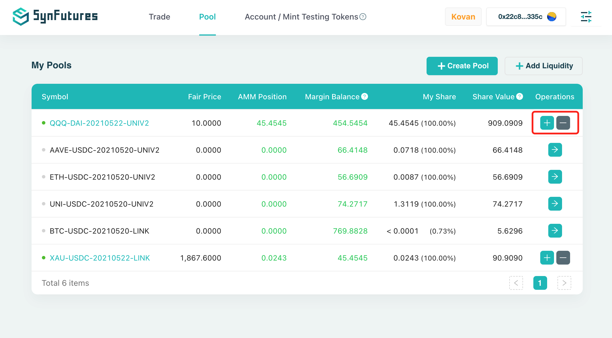

SynFutures is a decentralized derivatives platform that allows various digital assets pairs to be freely created and traded. This tutorial will show you how to **create any new futures pair on SynFutures, using corresponding market in Uniswap V2** .

SynFutures can use any on-chain asset as quote, but we decided to start with ETH, DAI, USDC and USDT. This should be enough for most scenarios.

- Base Token: Any ERC-20 token, as long as there is a spot market in Uniswap V2;
- Quote Token: ETH, DAI, USDC, and USDT only;

In nutshell, there are simply 3 steps:

1. Find your new ERC-20 token ;
2. Create a spot market of this token in Uniswap V2 (please skip this step if such spot market already exists);
3. Create and initiate the new pair on SynFutures.

**Find your new ERC-20 token**

Futures market on SynFutures can use Uniswap pair as the spot index oracle. Thus, before creating a futures market on SynFutures, make sure there exists a proper spot exchange market on Uniswap V2. If there is not when you are issuing your own ERC-20 assets, you need to create the pair on Uniswap V2 first. Don’t worry, we also present a detailed tutorial here using a fresh new ERC20 token QQQ(https://kovan.etherscan.io/address/0xa63164DB023694A6726d37eeA6447dD4d13587ed) as Base.

**Create a new trading pair on UniswapV2**

Take “QQQ” token and “DAI” token on kovan as an example, suppose we want to create QQQ/DAI pair on SynFutures. We need to go to UniswapV2 (https://app.uniswap.org/#/pool) to create this pair. Suppose 1 QQQ is worth 10 DAI, click the “Create a pair” button, and input 10000 QQQ along with 100000 DAI (token address is needed to select QQQ and DAI), then click “Supply” button. You will be promoted to Approve both QQQ and DAI if it’s the first time for your account to interact with UniswapV2 using these tokens. After all transactions are confirmed, we are done with UniswapV2 in this tutorial.

**Create & Initiate a new pair on SynFutures** 

With QQQ/DAI pair created on UniswapV2, SynFutures could now create the spot index price feeder for this pair, and we can go ahead to create a futures market for QQQ with regarding to DAI on SynFutures (https://kovan.synfutures.com/#/trade). 

Click “more” for Uniswap V2 category in the “Base” drop-down list. After pasting the QQQ token address, “QQQ” token symbol will be displayed. 

Select “DAI” as quote token, and an expiry date for this pair as the Maturity on trade page, or alternatively, you could go to “Pool” Page and click the “+ Create Pool” button and QQQ/DAI pair maturing on your desired date, in our example 2021/05/22 will be created once the transaction is confirmed. 

After the transaction for creating pair is confirmed, click “Initialize Pool” button to add initial liquidity to the pair.

At the initialize page, you can input the initial price of QQQ/DAI (the price of QQQ measured in DAI at the day of maturity in your mind), which should not deviate from the current spot index price too much, together with the number of DAI you would like to add. Leverage affects the positions added to the pool. Higher the leverage, bigger the positions. You can adjust the leverage bar to see the simulated state changes related to your account for the initialization.

Since we are the only liquidity provider up until now, AMM holds the same number of LONG positions as our SHORT positions. All pairs we have added liquidity to are shown in the pool page, we can add more liquidity or remove liquidity with “+” “-” Buttons, respectively.

