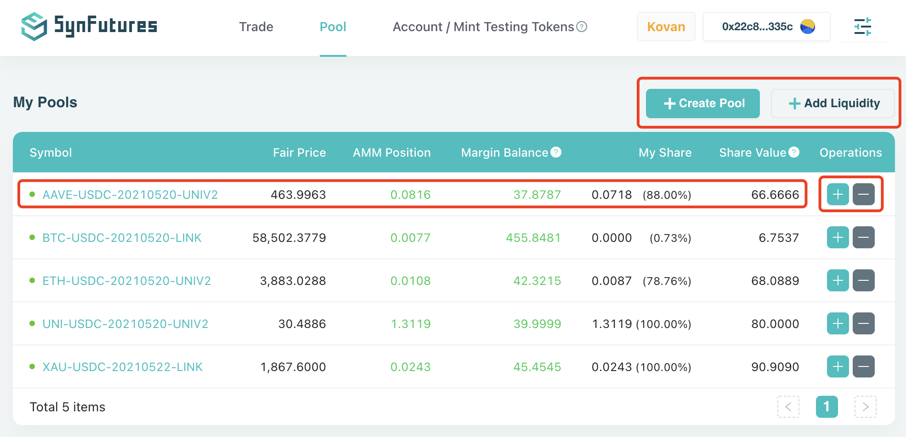
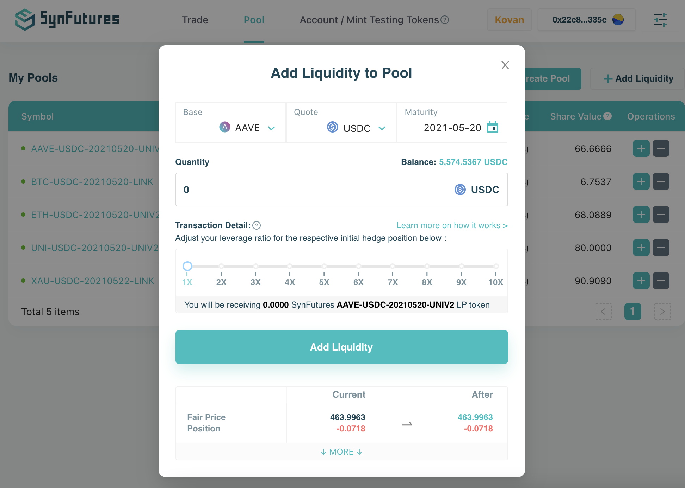
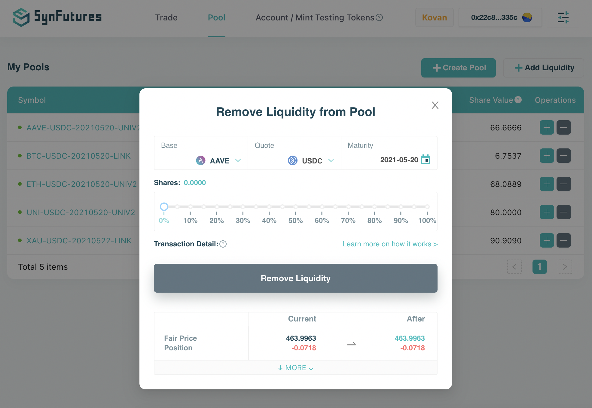
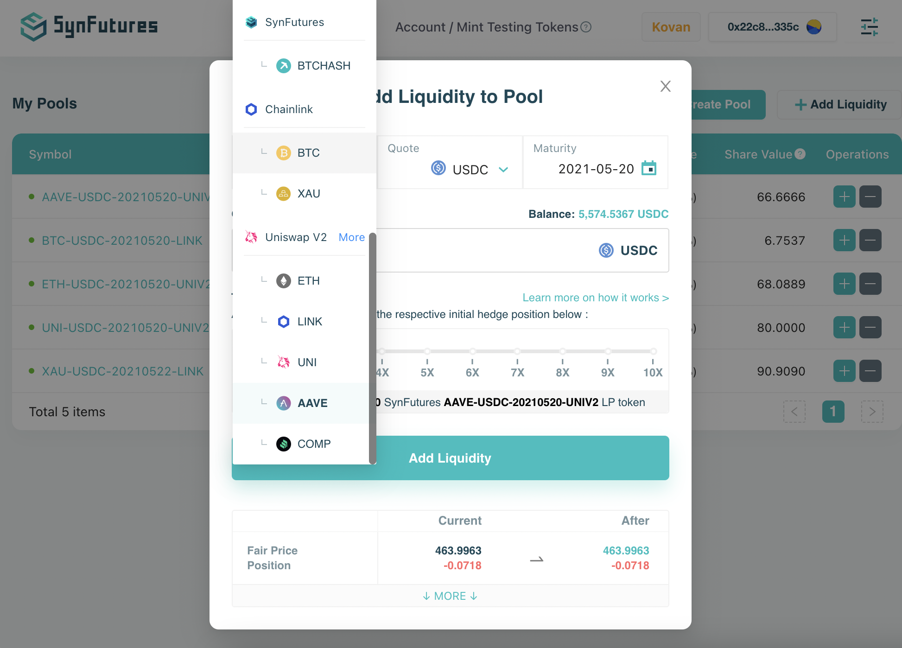

For a Liquidity Provider, simply start the **Add/Remove Liquidity** process by opening the Pool tab. It lists out key liquidity pools information by contract, including:

- Contract Symbol
- Contract Fair Price
- Contract current AMM Position
- Your current Margin Balance in this contract
- Your Share of the contract's liquidity pool
- Your Share Value

To Add/Remove Liquidity **in a pool you already provide liquidity** (i.e. listed in the table), simply click on the "+/-" Add/Remove Liquidity buttons under Operations to start the process. 

- To Add Liquidity, you would need to specify your intended liquidity addition Quantity in number of Quote tokens. Contract details including Base, Quote, and Maturity are pre-selected and fixed here. For example, if I would like to add 100,000 USDC liquidity to ETH-USDC-20211231-UNIV2 contract which I already provided liquidity and have a share, I would simply put 100,000 in the Quantity field and click Add Liquidity.

- To Remove Liquidity, you would need to specify the removal Percentage of your pool's share. For example, if I would like to remove 20% of my liquidity provision in ETH-USDC-20211231-UNIV2 contract, I would simply click on 20% mark on the slider bar and click Remove Liquidity.

To Add Liquidity **in a pool in which you don't have existing share**, simply click on the Add Liquidity button on the top right corner. Here you can choose any available Base, Quote, and Maturity to specify the exact contract in which you would like to provide liquidity. Please note this can only apply to contracts which have already been created (by developers or by other users).

