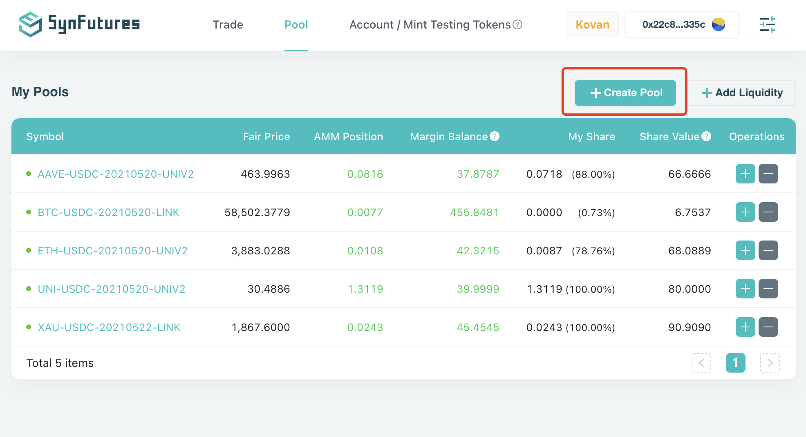
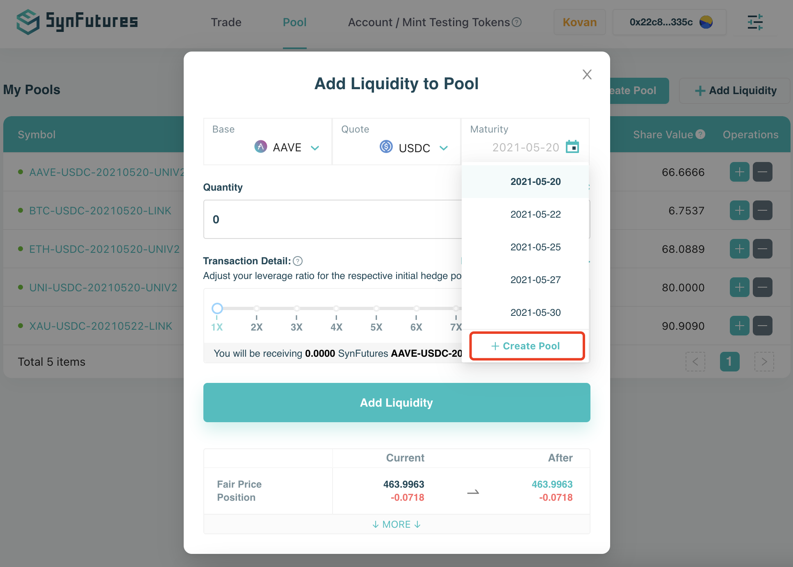
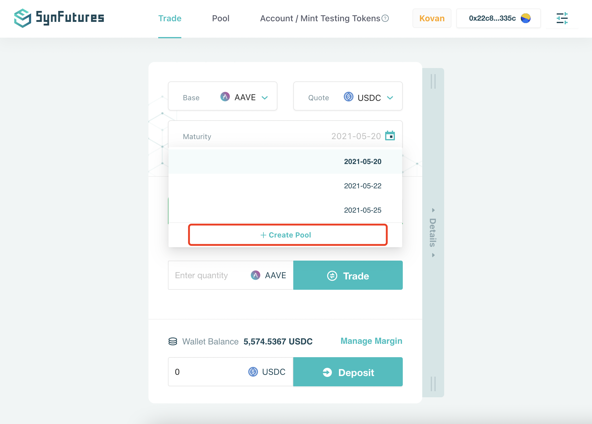
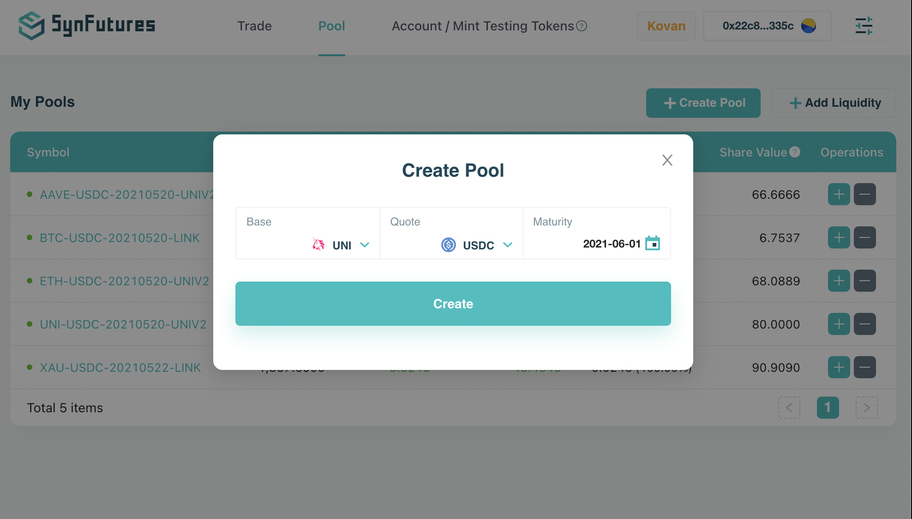
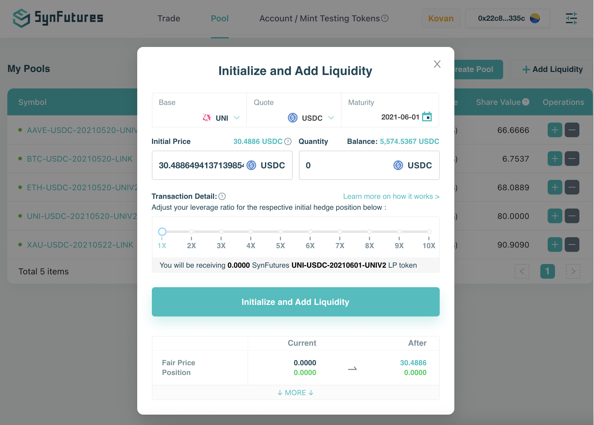

If the Base/Quote pair already exist, yet you would like to be the first liquidity provider on a new maturity date, there are 3 ways to start the process. 

- Click Create Pool button on the top right corner of Pool tab;
- Choose Create Pool in the Maturity dropdown in Add Liquidity interface; or
- Click on Create New link on Trade tab.

After specifying Base, Quote, and (new) Maturity, click Create button to complete the new contract creation. Afterwards, click on Initiate Pool button to provide liquidity. Please note that you need to specify a Initial Price of this newly created contract. The rest follows the same instruction as an existing pool.

You will own 100% of the newly created pool share in the beginning. 

Please note that this process only works with existing Base/Quote Pairs. For creation of new Base/Quote Pairs, please refer to the next section. 
