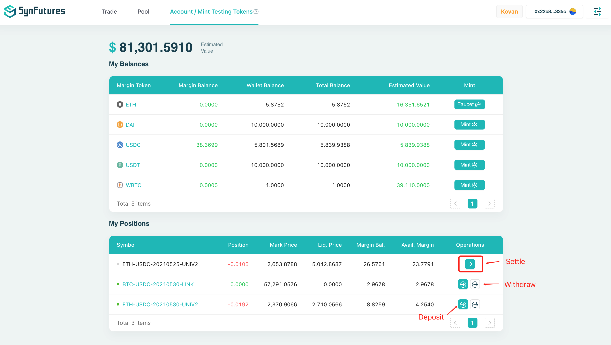

To view and manage your margin, please open the Account tab. It lists out key margin information by contract, including:

- Contract Symbol
- Your Position under this contract
- Contract current Mark Price
- Your Position’s corresponding Liquidation Price
- Your current Margin Balance
- Your Available Margin
- Available Margin Operations at this stag

 

Available Operations would vary given different status of the contract.

- If the contract is in *TRADING* status, you can operate below 2 functions:
  - **Deposit** – top-up from your wallet and increase Margin Balance to lower leverage of existing Position as a protection from Liquidation, or to prepare for entering into a new/larger position;
  - **Withdraw** – cash out to your wallet and decrease Margin Balance (by up to the Available Margin amount) to increase leverage of existing Position, or to cash out after closing a previous position.

- If the contract is in *SETTLING* status, no operation is available.
- If the contract is in *SETTLED* status, you can operate 1 function:
  - **Settle** – settle the remaining Margin Balance back to your wallet

