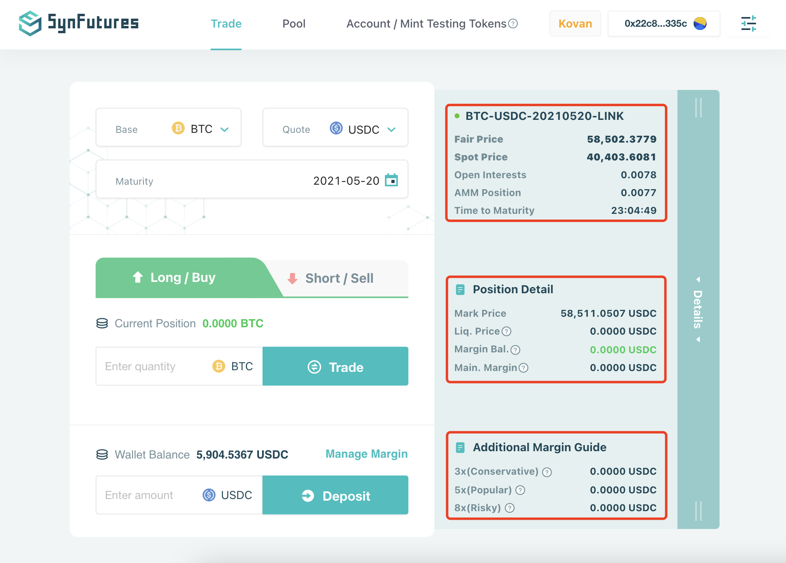

Please click on Details bar on the right side of the Trade tab, if you would like to see extensive details regarding the contract, the position, as well as a quick guide to margin deposit.

 The detailed information listed has 3 main sections:

1. **Contract Information**, including the basic information of the selected futures contract such as Fair Price, Spot Price, Open Interest, AMM Position, and Time to Maturity.
2. **Position Details**, including your existing position and margin information in the selected contract.
3. **Additional Margin Guide**, serving as a quick "cheat sheet" to estimate the additional margin, if any, needed to complete the trade with a portfolio leverage level. You can also click on the numbers to automatically pop up the Deposit Amount fiend.

