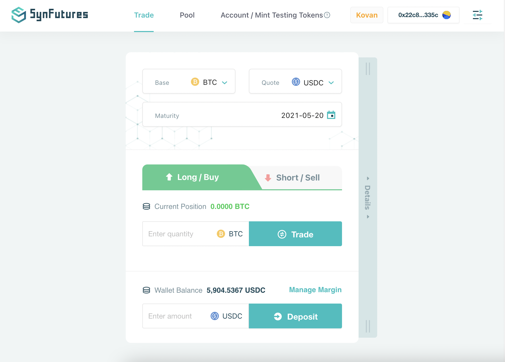

Please follow below simple steps to open or close a position:

1. **Choose a contract** by selecting your preferred Base, Quote, and Maturity from drop-down menus.
2. **Choose your trading side** and amount by selecting the Side tab and input the Quantity in the field. To close an existing position, simply choose the reverse trading side and input same amount.
3. *(Optional. Please skip this step if you already have sufficient Margin Balance)* **Deposit sufficient margin** by inputing the desired Deposit Amount and clicking the Deposit Button. 
4. **Complete the trade** by clicking the Trade Button and approve in your wallet.

