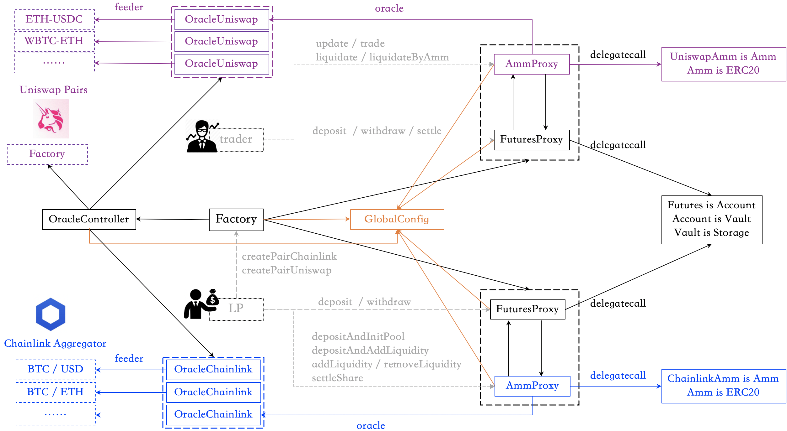

## SynFutures@v1概述

SynFutures@v1是参考Uniswap的现货交易模式构建的分布式期货交易平台，与Uniswap中任何人都可以创建新的现货交易对类似，SynFutures@v1允许任何人创建任意base/quote、任意到期日的期货市场，例如3天后到期的BTC/USD期货市场，当月的ETH/USDC期货市场以及当季的ETH/USDT期货市场。也就是说base、quote、expiry三个对应一个独立的期货合约。

### Oracle

合约的价格会收到现货价格波动的影响，受制于当前区块链行业Oracle的发展现状，并不是所有的base/quote都有可靠的价格Oracle，SynFutures@v1目前仅支持使用Uniswap和Chainlink作为Oracle，并且要求quote是Ethereum上的原生资产，SynFutures@v1启动时允许的可以作为quote的资产包括：ETH、USDC、USDT、DAI。

- 如果base也是Ethereum上的原生资产，SynFutures@v1默认使用Uniswap作为价格Oracle。
- 如果base不是Ethereum上的原生资产，SynFutures@v1默认使用Chainlink作为价格Oracle。

无论是依赖Uniswap或者依赖Chainlink，SynFutures@v1都要处理与相应Oracle机制相关的特殊问题。Uniswap方面，使用Uniswap的现货交易对的Oracle容易遭受价格操控，SynFutures@v1中引入了额外的控制机制来尝试减缓这一影响，后文再做详细介绍。Chainlink方面，BTC等资产的报价会以USD为单位，而Ethereum上的USDC、USDT、DAI等美金稳定币相对USD都会有小范围波动。为了应对这种情况，对于依赖Chainlink的期货合约，SynFutures@v1将USDC作为USD在Ethereum上锚定资产，也即SynFutures@v1中依赖Chainlink的USD报价的期货合约中的quote均为USDC。例如SynFutures@v1中依赖Chainlink作为Oracle的BTC/USD期货合约中的quote实则是USDC，也即如果Chainlink给出的BTC/USD价格为18000USD，则SynFutures@v1的BTC/USD期货合约认为BTC的当前价格为18000USDC。

### 交易和做市机制

做市商机制方面，以Uniswap、Curve为代表的恒定函数做市商证实了AMM的可行性，mcdex、perp等项目也运用AMM机制构建链上永续合约，SynFutures@v1充分借鉴了DeFi领域现货以及衍生品方面的AMM机制设计。通过将该做市商模型适配到期货合约的业务场景之中，SynFutures@v1在做市商机制方面采用了名为“sAMM”的恒定乘积自动做市商模型，来为任意期货合约提供充分的流动性。与Uniswap类似，流动性提供者（Liquidity Provider，LP）可以创建任意的期货合约，并且可以为期货合约注入流动性。Uniswap的恒定乘积模型中要求LP向资金池中注入两种资产，而在期货合约的视角下，这是不可行的，因为LP手中通常并不存在代表base的LONG或者SHORT仓位的资产。为了解决这一问题，SynFutures@v1采取的策略是计：LP向合约中注入的流动性中的一半作为quote资产，另一半则用于合成仓位。这也是sAMM名字的由来：“s”表示“synthetic”。

用户（trader和LP）在其参与的期货合约当中都有相应的账户（`Account`），Amm也有自己的`Account`。`Account`中记录当前用户的仓位（position）、资金余额（balance）等信息。用户可以向自己的账户中注入资金（`deposit`）、取回资金（`withdraw`）。为账户注入资金之后，trader可以通过与Amm交易（`trade`）的方式做多（buy/long）或者做空（sell/short），而LP则可以利用注入的资金通过添加流动性（`addLiquidity`）成为流动性提供者（Liquidator Provider）。用于提供流动性的资产，也可以被移除（`removeLiquidity`）。添加流动性时LP会获得相应的LP Token，移除流动性时会燃烧掉相应的LP Token。根据价格波动，如果一个账户中的资金余额不足以保证其当前仓位的安全性，任何人（除了该账户自己）都可以发起对该账户的清算（`liquidate`）。清算通常是指清算发起方用自己的账户接管目标账户的仓位，这对于清算发起人的账户状态有较高的要求。为了降低这一门槛，SynFutures@v1引入了额外的清算方式：借助Amm清算目标账户（`liquidateByAmm`），也即清算发起人可以利用Amm的账户来清算指定账户，并获得奖励。

### 合约生命周期

充分参考中心化交易所以及传统金融市场的期货产品逻辑，SynFutures@v1将一个期货合约的生命周期分为：NORMAL、SETTLING以及SETTLED三个阶段，并且强制期货合约在到期之前SETTLING至少一小时。刚创建并初始化完成的期货合约进入NORMAL状态，期货合约在适当时间会进入SETTLING状态，并且经过至少一个小时的SETTLING之后，合约状态变为SETTLED状态。值得提及的是，强制期货合约SETTLING一小时，有可能会导致期货合约真正的到期时间晚于合约创建时指定的到期时间。这是由于智能合约本身的状态更新只能通过交易触发导致的，具体来说可能会出现这种情况：在指定的到期时间的前一小时左右没有发生任何交易，也就导致在期货合约无法严格执行在预先设定好的到期时间前一小时进入SETTLING状态。

为了处理这种情况并且强制合约在到期之前SETTLING至少一小时，SynFutures@v1采取的策略是：NORMAL状态下处理交易时，会首先根据期货合约创建时指定的到期时间判断此时合约状态是否应该SETTLING（甚至SETTLED），如果是则将合约状态改为SETTLING，并且根据此时的区块时间重新设置到期时间为一小时之后。这种方式可以保证所有合约在到期之前都会经历至少一小时的SETTLING（由于同样的原因，期货合约的SETTLING时间可能大于一小时，不再赘述）。可以预期的是交易活跃的期货合约，真正的到期时间与合约创建时的指定的到期时间会基本保持一致。另外，为了鼓励用户通过发起交易来更新（`update`）期货合约的状态，SynFutures@v1引入了额外的奖励机制。

NORMAL和SETTLING状态下，markPrice的计算方式不同：SETTLILNG状态会采用时间加权的方式计算mark price，稍后再详细介绍。不同的合约状态下，trader和LP可以执行的操作以及限制有所不同：

- NORMAL状态下：trader可以`deposit`、`withdraw`、`update`、`trade`、`liquidate`以及`liquidateByAmm`，而LP可以`deposit`、`withdraw`、`addLiquidity`、`removeLiquidity`（LP当然也可以作为trader的角色执行`update`、`trade`、`liquidate`、以及`liquidateByAmm`操作）。

- SETTLLING状态下：该状态下，所有操作都减少相应账户中的仓位，而不能增大仓位。因此trader可以执行在NORMAL状态下的各种操作，但有了额外的约束条件：`trade`时只能关闭自己的已有仓位，不能增加自己的仓位；而LP方面则不允许`addLiquidity`，只能`removeLiquidity`，这是因为`addLiquidity`会导致AMM账户中的仓位增加。
- SETTLED状态下：trader只能根据结算价格关闭自己的仓位（`settle`）；LP方面则需要通过LP Token取回向资金池中注入的资产，然后通过`settle`来关闭仓位。值得提及的是，`settle`时用户的资金会自动从`Account`中转出。

另外为了对应当下不可预见的链上异常情况（Oracle失效等问题），SynFutures@v1中还额外引入了名为EMERGENCY的状态，EMERGENCY状态下，普通用户和LP均不得进行操作，而系统管理员可以根据实际情况，以合理的结算价格（Settlement Price）引导期货合约进入SETTLED状态。

## 术语列表

- 初始保证金率（Initial Margin Ratio，IMR）：
- 维持保证金率（Maintainace Margin Ratio，MMR）：
- 保险基金费率（Insurance Premium Ratio）：
- 指数价格（Index Price）：
- 标记价格（Mark Price）：
- 公允价格（Fair price）：
- 可用保证金（Available Margin）：
- 入场成本（Entry Notional）：
- 账户盈亏（Profit and Loss，PNL）：
- 指数移动平均值（Exponential Moving Average，EMA）：
- 社会化损失（Social Loss）：
- 时间加权平均价格（Time Weighted Average Price，TWAP）：
- 未平仓量（Open Interests）：

## Margin与Account

相同base、quote，不同expiry的期货合约依赖不同的sAMM，即逐仓模式(`fixed margin`)，会导致流动性相对分散的问题。SynFutures@v2中会利用全新的sAMM模型来解决这一问题，并实现全仓模式(`cross margin`)。SynFutures@v1中为了避免流动性的过于分散，在SynFutures@v1启动时，会通过参数配置来将所有期货合约的到期时间对齐至用户指定的到期时间所在周的周五下午四点（北京时间）。视SynFutures@v1的发展情况，团队会在合适的时间点放松到期时间强制对齐的限制：届时所有期货合约的到期时间将对齐至用户指定的到期时间当日的下午四点（北京时间）。

可以预期的是，相同base、不同quote之间的期货合约交易量会有所不同，因此SynFutures@v1会为不同的quote分别指定和调整相应期货合约的到期时间设置，以更好的跟随市场情况调整。鉴于当前Oracle领域的进展，SynFutures@v1中最开始的支持的可以作为quote的资产包括：ETH、USDC、USDT、DAI。因此SynFutures@v1会在全局参数中为每一个支持的quote保存该margin的配置信息`MarginParam`，结构体定义如下。其中`allowed`和`alignToFriday`不再赘述，而`updateReward`则指定了当用户`update`相应期货合约状态时，可以获得的对应margin的奖励数额。

```
struct MarginParam { // only takes 1 slot
    bool allowed;         // margin can be used as quote?
    bool alignToFriday;   // align expiry to Friday?
    uint128 updateReward; // reward in margin's decimal to incentive user to update futures
}
```

SynFutures@v1中期货合约由base、quote、expiry唯一确定，每个期货合约都有自己的sAMM来提供流动性，也都有相应的账户列表来记录trader、LP以及sAMM的资金余额、仓位、入场成本等信息。SynFutures@v1中用结构体`Account`来记录每个账户的链上状态：

- `balance`字段表示当前账户的资金余额，由于账户仓位的亏损可能超过账户的资金余额，因此该字段可能是负值；
- `position`字段表示当前账户的多头或者空头仓位，正数表示LONG，负数表示SHORT；
- `entryNotional`是当前账户仓位的入场成本；
- `entrySocialLoss`则表示持有当前仓位时，当前仓位方向（LONG或者SHORT）的社会化损失成本。

```
struct Account {
    int128 balance;
    int128 position; // positive for LONG, negative for SHORT
    uint128 entryNotional;
    int128 entrySocialLoss;
}
```

期货合约的整个生命周期中会出现多个账户破产被清算的情况，比如base相对quote的价格持续上涨时，持有SHORT仓位的账户会持续亏损，当`AccountBalance + UnrealizedPnl < Position * MarkPrice * MMR`时，该账户就不再安全可以被清算，清算可能会导致账户的`balance`为负值。

- 当清算导致账户的`balance`为负值时，首先用期货合约的保险基金来给予清算人一定的奖励，然后尝试用保险金来填补这部分亏空
- 如果亏空数额超过了保险金余额，超过部分的损失累积到LONG方向的社会化损失当中，这部分损失由此刻持有LONG仓位的所有人按照持有的仓位数量按比例共同承担。

为了计算一个账户的从持仓到清仓这段时间内，该账户所应承担的社会化损失，只需要知道两个时刻处累积的社会化损失的差值以及用户持仓数量即可。因此在`Account`中需要保存用户的持有`position`个仓位时刻的累积社会化损失。

而整个期货合约可行的关键在于sAMM的设计。如前所述，通常并不存在代表base的LONG或者SHORT仓位的资产，而sAMM通过合成仓位的方式来解决这一问题。以ETH/USDT的期货合约整个生命周期为例，介绍具体的机制设计。期货合约创建时，会根据`MarginParam`中的配置信息，对齐到期时间。期货合约创建完成之后，LP需要向池子中注入流动性以完成期货合约的初始化。当然在注入流动性之前，首先需要`deposit`到合约中。为了便于LP操作，SynFutures@v1为LP额外提供了两个接口函数：`depositAndInitPool`以及`depositAndAddLiquidity`，将存款和添加流动性的操作合并到一起。

Ethereum上不同资产的精度不同，为了便于合约内部统一处理，SynFutures@v1内部将所有资产的精度放大到18位，这一实现细节同样影响了用户交互的合约方法的输入参数，也因此SynFutures@v1不支持精度超过18位的资产作为quote。SynFutures@v1中所有需要输入资产数量的地方，都默认相应输入值是被放大过的。例如6位精度的USDC，$1000 * 10^6$表示1000USDC，而同样的数值在SynFutures@v1内部记录为$1000 * 10^{18}$，在`withdraw`时SynFutures@v1根据资产精度会进行适当转换。与相应资产合约交互时，会将数值转换到合适的精度，不足1个最小单位资产的数量直接截断。

数值精度方面，除了用于表示时间的秒数，SynFutures@v1内部也统一将其它所有数值均放大$10^{18}$，例如`Account`中的`balance`按照前述风格是18位精度的资产表示，而`position`、`entryNotional`和`entrySocialLoss`也同样被放大$10^{18}$，这一方面是为了用规避处理Solidity不支持浮点数的限制，SynFutures@v1内部可以认为小于$10^{18}$的整数值其实是在表示小数，例如0.1在$10^{18}$内部对应的值为$10^{17}$。另一方面也是为了提高精度，浮点数运算总会有精度损失的问题，而放大之后再进行最低位的四舍五入可以将误差的影响降低到最小。

数值精度方面，还有一个例外，是全局参数的存储方面。由于大多数全局参数均表示某个百分比，也即值是小于1的浮点数，4位精度小数对于参数配置已经充分足够，并且用户与期货合约的各种交互都需要访问多个全局参数，为了降低全局参数占用的链上存储空间并且在用户与合约交互时减少gas消耗，全局参数的存储时只放大了$10^{4}$，这足够用来表示4位精度的浮点数，这种选择也可以用`uint16`表示一个配置参数，从而可以讲所有的全局参数存储到Ethereum的一个链上slot中，SynFutures@v1内部使用全局参数时，会首先将全局参数放大$10^{14}$，以使相应数值与系统内部数值表示保持一致。

一个自然的问题便是，`int128`或者`uint128`用来存储放大过的数值是否足够？`int128`的取值范围为$[-2^{127},2^{127}-1]$，`uint128`的取值范围为$[0, 2^{128}-1]$，而$\log(2^{127}-1, 10) \approx 38.23$，可以看到`int128`和`uint128`用来存储数值是足够的。SynFutures@v1内部运算都是在`uint256`或者`int256`类型的数值上展开的。为了防止被放大过的数值连乘导致数值太大发生溢出，两个被放大过的数值相乘时，会将结果缩小$10^{18}$，并在最低位进行四舍五入。同样两个被放大过的数值相除时，会首先将被除数放大$10^{18}$，然后按照四舍五入的原则进行整除截断。

## sAMM

### 添加/移除流动性

期货合约创建完成之后，LP需要通过`depositAndInitPool`方法存款并向合约中注入流动性，其输入参数分别为：

- `wadAmount`表示要存入的margin的数量，注意这是采用18位精度表示的margin资产的数量。
- `initPrice`是指定的base/quote的价格，SynFutures@v1要求该价格与当前指数价格的偏差不得超过全局参数`maxInitialDailyBasis`所限定的比例。
- `leverage`是指定的杠杆倍数，含义稍后介绍。
- `deadline`限定了这笔交易的成交时间不得晚于该时间，与以太坊的区块时间戳同样采用UTC时间的流逝的秒数。SynFutures@v1中所有非查询操作的最后一个参数都是`deadline`，用于限定交易执行的时间不得晚于该时间。此后不再赘述。

```
function depositAndInitPool(uint wadAmount, uint initPrice, uint leverage, uint deadline) public payable
```

sAMM的机制设计中，AMM的账户中只有LONG仓位并且总是足额抵押以确保AMM的账户总是安全的。如前所述，LP添加的流动性的一半作为quote，另一半则用于合成AMM的LONG仓位。也因此LP在注入流动性之后会被动持有等量的SHORT仓位。由于持有SHORT仓位，因此为了保证LP账户的安全性，LP存入合约中的资金应当至少在账户中保留合成仓位价值IMR比例的数量作为仓位保证金。`leverage`参数就用来指定存入的`wadAmount`数量的资产的分配方式。假设LP通过该操作最终在AMM中合成了`size`个LONG仓位，则各个参数与`size`之间的关系为：

```
wadAmount = initPrice * size * 2 + price * size / leverage
size = wadAmount / (2 * price + price / leverage)
```

为了防止LP指定的`initPrice`不合理，SynFutures@v1中通过全局参数`maxInitialDailyBasis`约束`initPrice`和Oracle给出的现货指数价格之间的价差绝对值不得超过`days * maxInitialDailyBasis`，其中`days`是期货合约以天为单位的时长。`depositAndInitPool`操作完成之后，LP会获得相应的LP Token，LP Token的名字遵循`BASE-QUOTE-EXPIRY-ORACLETYPE-V1`的模式，例如2020年12月30日到期的选用Chainlink的BTC/USD合约的的LP Token名字为`BTC-USD-20201230-LINK-V1`。除此之外，`depositAndInitPool`还会初始化`MarkPriceState`的状态，`MarkPriceState`用于辅助在期货合约的整个生命周期当中辅助标记价格（mark price）的计算，稍后介绍。

sAMM初始化完成之后，LP可以通过`deposit`和`addLiquidity`两步操作继续向AMM中注入流动性，当然也可以通过SynFutures@v1提供的`depositAndAddLiquidity`方法一次性完成两步操作，该方法的输入参数与`depositAndInitPool`基本一致，只是少了用于指定价格的参数。这是因为sAMM初始化之后，后续的流动性注入，必须按照sAMM给出的公允价格（Fair Price）进行。sAMM给出的公允价格`FairPrice = x / y`，其中`x`表示AMM账户中的可用保证金，`y`是AMM当前持有的LONG仓位。`depositAndAddLiquidity`方法中同样可以通过`leverage`参数调整`wadAmount`中有资金注入AMM和留在LP账户中的资金量。值得提及是，`depositAndAddLiquidity`操作只允许在NORMAL状态下进行。

```
function depositAndAddLiquidity(uint wadAmount, uint leverage, uint deadline) public payable returns (bool, uint)
```

如前所述，LP也可以通过两步操作完成上述过程：`deposit`和`addLIquidity`，而`addLiquidity`也只允许在NORMAL状态下进行。为AMM注入流动性之后，在NORMAL和SETTLING状态下，LP可以通过`removeLiquidity`操作按照AMM当时的价格来移除流动性同时关闭仓位，并通过`withdraw`取回资产；而在SETTLED状态下，LP可以通过`settleShare`操作按照结算价格来移除流动性，并在随后通过`settle`操作关闭账户中的所有仓位（包括作为trader买入做多和卖出做空导致的仓位）并同时取回资金。NORMAL和SETTLING状态下，`removeLiquidity`会降低AMM中流动性，为了防止AMM中流动性过低引发后续交易滑点过高的问题，SynFutures@v1要求`removeLiquidity`要求在移除流动性之后，AMM持有的LONG仓位占比不得低于期货合约的未平仓量（open interests）的某个比例。全局参数`minAmmOpenInterestRatio`中规定了这一比例。

### 买入做多/卖出做空

LP创建期货合约并提供流动性之后，trader可以通过AMM进行买入做多或者卖出做空的交易，由于BUY和SELL操作执行逻辑上的相似性，SynFutures@v1用`trade`方法来同时表示BUY或者SELL操作，具体交易方向根据第一个布尔参数`buy`进行区分。`trade`方法的参数`size`表示要交易的仓位数量，而``limitPrice`则用于限制交易滑点。

```
 function trade(bool buy, uint size, uint limitPrice, uint deadline) public returns (bool)
```

交易的价格是AMM根据交易发生时AMM中的可用保证金`x`、LONG仓位`y`以及交易`size`计算得到。值得注意的是，由于SETTLING阶段不允许新开仓位，因此SETTLING期间，trader实际可以交易的`size `是参数指定的数量与当前账户持仓数量的最小值。

- BUY/LONG：`price = x / (y - size)` ，此时`limitPrice`为买入价格上限，也即要求`limitPrice >= price`
- SELLL/SHORT：`price = x / (y + size)`，此时`limitPrice`为卖出价格下限，也即要求`price >= limitPrice`

可以看到，BUY/LONG时分母为`(y - size)`，为了保证运算正确性要求`size < y`。BUY/LONG时会降低AMM的LONG仓位数量，因此与`removeLiquidity`类似，在BUY/LONG时，SynFutures@v1同样要求在交易完成后，AMM持有的LONG仓位占比不得低于期货合约的未平仓量的`minAmmOpenInterestRatio`比例。如果该要求不满足，则整笔交易失败。

为了防止市场的某个仓位过于集中在某些用户手中，以防止市场风险过于集中于某些用户（在清算这些账户时会引发问题），SynFutures@v1要求若某个用户的持仓比例过高（由全局参数`maxUserTradeOpenInterestRatio`指定的），该用户只能进行平仓操作而不能增加仓位。与AMM交换完仓位之后，如果这笔交易在用户账户中导致了新开了仓位，则会检查这一约束条件，不满足则整笔交易失败。值得提及的是，仅需要在NORMAL状态下执行这项检查，SETTLING阶段由于之前的检查不会出现在trader账户中新开仓位的现象。

考虑到通过智能合约来实现期货合约这一特殊现实，为了保护用户利益，SynFutures@v1在执行交易时还引入了另外一个约束参数`maxPriceSlippageRatio`，该参数用来限制在一个区块的中通过和AMM交易允许的最大双向滑点，等价于每个区块内的所有交易都有一个限价，保证该区块内AMM的价格波动在一定的范围内。这可以防止通过单笔大额交易来扭曲AMM的价格。因此`trade`操作中，在完成用户与AMM的仓位交换之后，会根据AMM最新状态确认区块价格滑点限制没有被破坏，否则整笔交易失败。

SynFutures@v1对所有的`trade`按照成交金额收取固定比例的费用，包括两部分费用，一部分为开发者费用，一部分为交易池费用，收取比例分别有全局参数`poolDevFeeRatio`和`poolFeeRatio`指定。

在`trade`交易的最后，还会确保用户账户和AMM账户在交换完仓位之后仍然是安全的，安全意味着如果用户账户因为这笔交易有了新开的仓位，则要求用户账户在当前的标记价格（Mark Price）下是IMSafe的（`(AccountBalance + UnrealizedPnl) >= Position * MarkPrice * IMR`），否则要求该账户是MMSafe的（` AccountBalance + UnrealizedPnl >=  Position * MarkPrice * MMR`）。之外还要求AMM账户也是MMSafe的（根据机制设计，AMM总是安全的，这里只是出于谨慎的目的，再每一次交易之后强制检查一次，因为这种检查并不会消耗很多gas）。关于指数价格的计算方式下一小节再详述。

### 价格

在上一小节，每一次通过AMM交易，都要求在交易之后账户在当前的标记价格之下是安全的，但我们尚未讨论SynFutures@v1中的价格机制。SynFutures@v1中总共有三种类型的价格：来自Oracle的指数价格（Index Price），来自AMM的公允价格（Fair Price），以及通过AMM维持并不断更新的标记价格（Mark Price）。

指数价格方面，对于Uniswap类型的Oracle，SynFutures@v1直接读取Uniswap中目标交易对中两种资产的余额，相除之后得到指数价格。为了减缓Uniswap的交易对提供的价格被人为操纵导致的价格距离波动，SynFutures@v1中引入了全局参数`maxSpotIndexChangePerSecondRatio`来限制通过这种方式读入的来自Uniswap交易对的指数价格。如果指数价格超过该参数允许的范围，根据允许范围内的极限值作为指数价格。对于Chainlink类型的Oralce，SynFutures@v1没有特殊处理，只是将Chainlink的USD报价视为以USDC为锚定资产的报价。

初始化AMM时（第一次向AMM中添加流动性时）指定的初始价格应当位于当前指数价格的合理偏移之内，后续添加/移除流动性以及买入做多卖出做空等操作，均按照AMM给出的公允价格执行，但是判断账户安全性时则依赖标记价格。前面提到`depositAndInitPool`会初始化`MarkPriceState`的状态，`MarkPriceState`用于辅助在期货合约的整个生命周期当中辅助标记价格（Mark Price）的计算。

```
struct MarkPriceState {
    uint32 lastMarkTime;
    uint112 lastIndexPrice;
    int112 lastEmaBasis;
    uint32 accIndexStartTime;
    uint224 accIndexPrice;
}
```

在NORMAL和SETTLING阶段，除`deposit`之外所有的操作（包括`withdraw`、`update`、`trade`、`addLiquidity`、`removeLiquidity`、`liquidate`、`liquidateByAmm`)都会首先根据的当前时间与合约到期时间来尝试更新期货合约的状态（NORMAL --> SETTLILNG --> SETTLED），也会根据当前的指数价格、当前时间更新`MarkPriceState`。其中当从SETTLLING状态切换至SETTELD状态时，会计算期货合约的结算价格。进入SETTLED状态，无需再更新期货合约状态，也无需进一步更新`MarkPriceState`。

- NORMAL状态下，只会更新`MarkPriceState`中以`last`开头的字段并按照指数移动平均方式根据当前`MarkPriceState`和Oracle提供的信息计算标记价格。
- SETTLING状态下，则会更新`MarkPriceState`中以`acc`开头的字段，并按照带时间权重的平均价格方式根据当前`MarkPriceState`和Oracle提供的信息计算标记价格。
- SETTLED状态下，无需更新`MarkPriceState`，并且标记价格就是结算价格。

```
function _markPriceWithState(Types.MarkPriceState memory state) internal view returns (uint) {
    if (status == Types.Status.NORMAL) {
        int index = uint(state.lastIndexPrice).toInt256();
        int p = index.add((state.lastEmaBasis));
        return p.max(0).toUint256();
    } else if (status == Types.Status.SETTLING) {
        return _twapAfterSettling(state);
    } else { // SETTLED or EMERGENCY
        return settlementPrice; // just return settlementPrice while settled
    }
}
```

**NORMAL状态下EMA方式更新`MarkPriceState`**

SynFutures@v1中NORMAL状态下标记价格的定义为现货指数加上标记基差。现货指数为标记价格提供了实时变化而标记基差通过使用指数移动平均（EMA）来让期货和现货之间保持稳定关系。NORMAL状态下，时刻$T$的标记价格$MarkPrice_T$按照以下过程计算：

$Basis_T = FairPrice_T - IndexPrice_T$

$MarkBasi_T = \alpha \cdot Basis_T + (1 - \alpha) \cdot MarkBasis_{T-1}, 其中 \alpha = 1 - e^{-\Delta T/\tau}$

$MarkPrice_T = IndexPrice_T + MarkBasis_T$

其中，$\tau$代表SynFutures@v1的全局参数`emaTimeConstant`，单位为秒，最大值为86400秒，也即24小时；$\Delta T$表示自从`MarkPriceState`的上次更新到当前时刻流逝的秒数，而上次更新时间记录在`MarkPriceState`的`lastMarkTime`字段中，上次更新是的指数价格记录在`lastIndexPrice`字段。

值得提及的是，对于异常不活跃的期货合约，可能会出现$\Delta T/\tau$值较大的情况，例如超过4甚至超过5，该值的增大对于在SynFutures@v1中采用的计算$e^{-\Delta T/\tau}$的近似算法并不友好。另一方面，有$ e^{-4.6} \approx 0.0100518357446336$，此时在$MarkBasis_T$的计算中，$MarkBasis_{T−1}$仅有1%的权重，并且随着指数绝对值的增大，其权重会进一步降低，导致$MarkBasis_{T−1}$对于$MarkBasis_T$几乎没有任何影响。SynFutures@v1中约定，当$e^{-\Delta T/\tau}$的指数的绝对值超过4.6值，均认为$MarkBasis_{T−1}$占有1%的权重。

**SETTLING状态下TWAP方式更新`MarkPriceState`**

在SETTLING状态下，SynFutures@v1中标记价格的计算采用时间权重加权平均的方式，会不断更新`accIndexStartTime`和`accIndexPrice`用于辅助TWAP方式的的标记价格计算，更新方式根据Oracle类型的不同有所不同。

Uniswap类型的Oracle在NORMAL状态下会直接读取目标交易对的余额并根据相除之后的值作为指数价格，并且为此引入了额外的控制参数。在SETTLING状态下，由于SynFutures@v1切换到TWAP的方式计算标记价格，而Uniswap V2的交易对自身就有随着时间累积的价格，鉴于此，进入SETTLING状态时，会首先将进入SETTLING状态时的时间记录在`MarkPriceState`的`accIndexStartTime`字段中，并且读取此时Uniswap中合适方向的累积价格并存储到`MarkPriceState`的`accIndexPrice`字段中。SETTLING阶段随后的不再更新该字段的值。每次需要计算标记价格时，会再次读取Uniswap的累计价格，并根据`accIndexPrice`和`accIndexStartTime`计算TWAP作为标记价格。

Chainlink类型的Oralce在NORMAL和SETTLING阶段都直接读取其反馈的价格作为指数价格。但是进入SETTLING阶段时，SynFutures@v1内部也会在`MarkPriceState`的`accIndexStartTime`字段中记录开始时间，并在`MarkPriceState`的`accIndexPrice`字段中记录按秒数累加的指数价格。每次需要计算标记价格时，则根据`accIndexStartTime`以及`accIndexPrice`计算自SETTLING以来的TWAP。


### 清算机制

SynFutures@v1中如果一个账户根据当前的标记价格不再安全（AccountBalance + UnrealizedPnl <  Position * MarkPrice * MMR），则当前期货合约的任意用户都可以发起针对该账户的清算操作。SynFutures@v1中支持两种形式的清算操作：

`liquidate`：清算发起人以当前标记价格强制接管被清算账户的所有仓位。被清算的账户所有仓位被关闭后，需要按照清算的总价值向保险基金（Insurance Fund）缴纳一定比例的罚金（从起当前账户余额中扣除），比例由去全局参数`insurancePremiumRatio`指定），而清算发起者则获得被清算账户的所有其他余额。然而如果被清算账户在关闭仓位后的余额不够支付罚金，则清算发起者可能无法获得额外奖励。此时从保险基金中按照清算总金额给予清算发起人一定的比例的奖励，该比例由全局参数`bankruptcyLiquidatorRewardRatio`指定。此时意味着被清算账户自身账户余额无法支付所有的亏损，则首先尝试利用保险基金覆盖损失，如果保险基金中的余额不足以填补亏空，则剩余部分由被清算账户的仓位的对手方按照持仓比例共同承担（也即更新期货合约的社会化损失）。要求清算发起人在接管所有仓位之后，其账户仍是安全的：如果清算过程中，清算发起人账户中开启了新的仓位，则要求是IMSafe的；如果清算过程中，清算发起人账户中没有开启新仓位，则要求是MMSafe的。

`liquidateByAmm`：强制被清算账户与AMM进行交易，交易价格按照`trade`的逻辑计算，以关闭其保证金无法支撑的仓位。值得指出的是，如果需要被清算的仓位在交易给AMM之后导致AMM的价格波动过大，则清算过程会失败。也即`trade`中所有的约束条件在此处仍然适用。同样的在强制被清算账户关闭适量仓位之后，可能会出现被清算账户的账户余额为负值的情形。此时也是首先尝试用保险基金来覆盖亏损，仍有亏损的部分由对手方仓位持有者按比例共同承担（更新期货合约的社会化损失）。`liquidateByAmm`最后会给予清算发起者固定的奖励，与`update`合约状态一样的奖励。

### 限制和保护机制

以下机制主要用于保护整个生态以及普通用户不会被设计外的使用方法攻击，包括例如通过闪电贷来操纵Oracle现货指数价格。以下限制参数均可通过`GlobalConfig`来调整。多数保护机制只在同一个block之内有效，而普通用户不会在同一个block进行复数操作，所以不会受到影响。

`maxPriceSlippageRatio`
限制一个block之内通过和AMM交易允许的最大双向滑点，等效于每一个block之内的限价机制，即在任何一个block之内，AMM的中间价不允许改变超过这个比例，来防止通过单个大单交易来扭曲AMM价格。若用户的单笔交易过大，引起了大于这个限制的滑点，交易会失败。

`maxInitialDailyBasis`; // |initPrice - indexPrice| < days * maxInitialDailyBasis
限制启动AMM的初始价格和现货指数之间的最大价差，以每日计，即在启动AMM的时候，初始价格和现货指数的价差绝对值不会超过`days` * `maxInitialDailyBasis`。通过这个限制，AMM的其实价格会被限定在一个合理范围之内

`maxUserTradeOpenInterestRatio`
限制单个用户持仓占整个市场的上限，来防止市场的风险过于集中于某些用户中。若某个用户的持仓比例高于该限制时，此用户只能进行平仓操作而不能增加仓位。虽然LP在给AMM增加流动性时不受此限制，但是如果LP增加流动性之后持仓比例突破了该限制之后，依然会只能平仓而无法加仓。

`minAmmOpenInterestRatio`
限制AMM持仓占整个市场的下限，来防止AMM的流动性过低。因为系统中的所有用户都只能和AMM交易，所以AMM必须保持一定的库存来防止产生过大的滑点。该限制对于用户和AMM交易以及LP从AMM提取流动性。

`maxSpotIndexChangePerSecondRatio`
限制AMM从上一次指数价格更新到现在为止所能接受的现货指数最大变化，以每秒计。由于标记价格`MarkPrice`每个block最多只会更新一次，所以这个限制相当于是对于MarkPrice的一个基于时间的限价机制来防止通过在一个block或者短时间内来回操纵现货指数价格来扭曲AMM的标记价格。

`bankruptcyLiquidatorRewardRatio`
表示替一个已经破产的账户清仓时用户可以从系统获取的奖励。保险基金会支付此奖励来吸引用户清仓已经破产的账户。

## 期货合约架构

相比Uniswap和当前DeFi领域的其它衍生品协议不同，SynFutures@v1中由于需要base、quote以及到期时间才能唯一确定期货合约，可以预期的是，SynFutures@v1的LP需要根据需要不断创建新的期货合约市场，这就对期货合约的整体架构提出了挑战，即如何最小化每个期货合约的创建。另外考虑到当前Ethereum网络时常的拥堵带来的gas price飙升的问题，SynFutures@v1也需要尽可能减少每一项用户操作的gas消耗。

### 降低期货市场创建gas消耗

虽然需要base、quote以及到期时间才能唯一确定期货合约，但是所有期货合约的内部逻辑是一致的，因为利用DELEGATECALL让所有的期货合约共享相同的运行时逻辑可以显著降低每个期货市场创建是的gas消耗。相当于链上仅有一份代码，而每个期货市场合约创建时仅需要分配自己所需的链上存储空间即可。

SynFutures@v1的每个期货市场合约中均涉及到sAMM、账户管理、quote的margin管理等操作，逻辑上这些都属于同一个期货市场合约，但是由于Ethereum对交易字节大小的限制，无法将所有的逻辑呈现在同一个智能合约当中，因此需要将期货市场逻辑进行拆分。SynFutures@v1采取的基本策略是：将逻辑拆分成两个大的部分：

- AMM自动做市：负责维持乘法恒定乘积以及链上`MarkPriceState`状态等。
- 账户和资产管理：负责记录更新每个账户状态、管理margin资产的存入和转出等。

AMM自动做市方面，由于链上`MarkPriceState`状态的更新机制根据Oracle类型的不同有不同的逻辑，因此采用了继承机制，基类为抽象合约：`abstract contract Amm is ERC20`，其中`ERC20`是LP Token，用于追踪LP在添加和移除流动性时候的权益，而该基类中根据逻辑需要抽象除了4个虚方法。

```
// 限制Uniswap的index price的波动范围
function indexPrice() public view virtual returns (uint price);
// 以下三个方法为virtual主要是因为
// Uniswap中无需SynFutures@v1内部根据时间累计价格，可直接采用Uniswap V2交易对中的信息
// Chainlink中则SynFutures@v1内部自己完成类似于Uniswap V2交易对中的价格累积
// 这一点差别会影响到如何累积价格计算、TWAP计算以及结算价格计算
function _twapAfterSettling(Types.MarkPriceState memory state) internal virtual view returns (uint);
function _cumulativePrice(
    Types.MarkPriceState memory state, bool justEntered
) internal virtual view returns (uint);
function _calculateSettlementPrice() internal virtual view returns (uint);
```

依赖Uniswap作为Oracle的AMM从`Amm`派生而来：`contract UniswapAmm is Amm`；依赖Chainlink作为Oracle的AMM也从`Amm`派生而来：`contract ChainlinkAmm is Amm`。`UniswapAmm`和`ChainlinkAmm`中为上述4个虚方法提供了具体的实现，不再赘述。

如前所述，为了利用DELLEGATECALL以及代理模式降低每个期货市场合约创建时的Gas消耗，SynFutures@v1实现了`AmmProxy`合约，该合约通过DELEGATECALL在利用`UniswapAmm`或者`ChainlinkAmm`的逻辑更新自己的状态。虽然`UniswapAmm`和`ChainlinkAmm`的具体实现有所不同，但是两个合约有着相同的接口，因此仅需要一个`AmmProxy`合约。

账户和资产管理方面的逻辑与Oracle种类无关，SynFutures@v1通过继承体系对相关功能进行了拆分。

```
contract Futures is Account, ReentrancyGuard // 对AMM和用户暴露必要接口
contract Account is Vault // 负责账户状态更新
contract Vault is Storage // 管理资金出入
contract Storage // 所有的链上存储：例如账户列表等
```

如前所述，由于资产的市值精度不同，`Vault`内部统一将所有资产的精度对齐到18，在用户存款、取款时自动转换，简化了Futures中的逻辑。同样为了用DELLEGATECALL以及代理模式，SynFutures@v1也实现了`FuturesProxy`合约。

Oracle方面，相同base、quote但是不同到期时间的期货合约可以依赖同一个Oracle，这样可以避免为每个期货合约市场都创建新的Oracle合约。Uniswap的现货交易对合约以及Chainlink的Aggregator合约在SynFutures@v1中被称为feeder，这些不同的feeder在SynFutures@v1内部被包装成`OracleUniswap`或者`OracleChainlink`。SynFutures@v1不控制哪些Uniswap交易对可以作为feeder，只要可以通过Uniswap V2的`Factory`获取到，创建和使用相应期货市场的用户需要明白其中的风险。另一方面，由于Chainlink中不同Aggregator的成熟度不同，SynFutures@v1中由管理员指定Chainlink哪些feeder可以作为Oracle。合约`OracleController`中记录所有已经创建过的`OracleUniswap`或者`OracleChainlink`，以便于Oracle的复用避免重复创建。

另一方面，根据前面描述，可以注意到所有的全局参数跟具体的base、quote或者到期时间无关，因此SynFutures@v1中所有合约都有一个指向全局参数合约的`GlobalConfig`地址指针，以访问所需的配置信息。

由于一个期货合约总是包括AMM自动做市与账户和资产管理两部分内容，因此创建新的期货合约时，需要创建一个`AmmProxy`以及一个`FuturesProxy`，并且两个合约都依赖对方提供的信息，因此在两个合约创建之后需要设置两个合约中的地址指针，将两个合约捆绑之后作为一个期货合约，这部分逻辑在`Factory`合约中完成。SynFutures@v1的`Factory`合约与Uniswap的`Factory`扮演了同样的角色。综上所述，SynFutures@v1最终呈现的架构如下图所示。得益于代理模式的采用，创建一个新的期货市场只耗费100万左右的gas。





### 降低用户操作Gas消耗

一方面，根据Solidity合约的开发时间，链上存储读写、外部合约调用等严重消耗Gas费用的。因此SynFutures@v1在实现时侧重针对相关方面进行了优化，尤其是考虑到期货合约逻辑拆解到两个合约当中并且还需要依赖代理模式转发来完成操作。另一方面，期货合约相关逻辑要求能够及时更新`MarkPriceState`等信息以即使追踪市场变化并给出合理的标记价格，然而智能合约本身又只能通过交易驱动来进行更新。基于这些考虑，SynFutures@v1在实现时遵循了以下策略。

- 在一个256比特的slot中保存多个相关字段，减少slot的读写次数，例如全局参数中的`Param`以及`MarkPriceState`等。利用`memory`缓存从链上存储中读取的信息，并在方法调用（合约内或者合约间）时传递，防止多次读取链上存储
- 减少`AmmProxy`与`FuturesProxy`之间交互，不得不交互时，在一侧完成尽可能多的操作之后再返回。为了达到该目的就需要在跨合约调用时，传递所有的所需信息，并在执行完成后返回所有需要的信息。

- NORMAL和SETTLING阶段，所有的用户操作都先根据当前区块时间和到期日期来驱动期货合约状态的更新（NORMAL --> SETTLING --> SETTLED），并且在操作中适时更新`MarkPriceState`，利用用户交互及时更新期货合约状态。可以预期的是，使用频繁的合约不会出现严重的状态滞后问题。另外为了鼓励用户发送交易触发合约状态更新，SynFutures@v1还设计了额外的奖励机制，用户可以执行`update`操作。通过将合约更新任务分散到用户操作中，我们预期SynFutures@v1的期货合约的整个生命周期之内都不需要开发团队的介入。

通过上述两种操作，SynFutures@v1的用户的一次`trade`操作消耗的Gas大约是22w，对比其他永续合约操作的Gas消耗，SynFutures@v1在Gas消耗方面有着明显的改进。