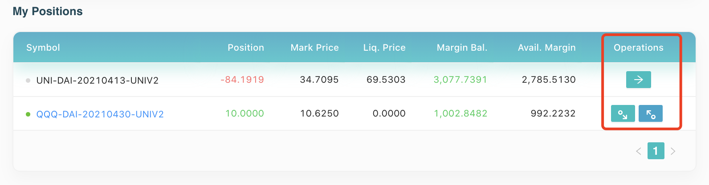

After the pair is settled, we can settle our shares to get margins back from AMM and settle all our positions according to the settlement price in the [Account page](https://kovan.synfutures.com/#/account) to withdraw all margins from the pair. 

For our example above, after QQQ-DAI-20210430-UNI pair matures, "Operations” for this pair in the account page "Operations” for this pair will become "Settle” instead of "Deposit/Withdraw” as shown currently in the following pictures.

The above is all you need to know about creating new pairs and trading on SynFutures, try it out and hope you enjoy the trading experience on SynFutures!