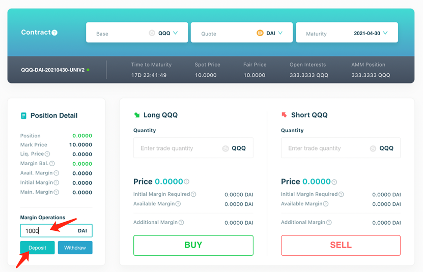
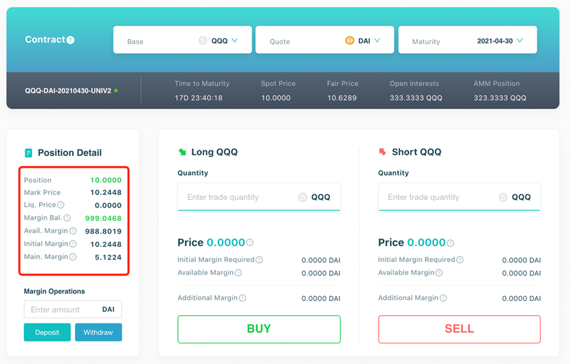
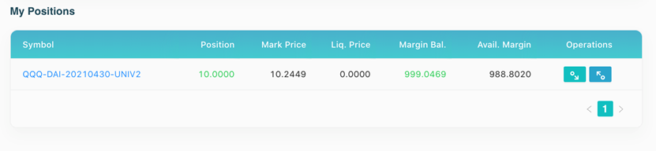

On "Trade" page, select the Base, Quote and Maturity, and you will have the details of contract.
Before trading, we need to deposit some margin token, in our example, DAI to the pair using the "Margin Operations" component.

After deposit is done, we can go LONG or SHORT within allowed amount range.

There are several limits on the trading amount for each trade for security considerations, which can be found in our FAQ (https://synfutures.github.io/docs/docs/parameters). Input the trade amount and click "BUY/SELL" button. After the transaction is confirmed, we can see the related changes in the "Position Detail" component.

To maintain these positions, we need to ensure the margin balance is higher than maintenance margin to avoid being liquidated. You could deposit and withdraw margin on "trade" page or "account" page.

